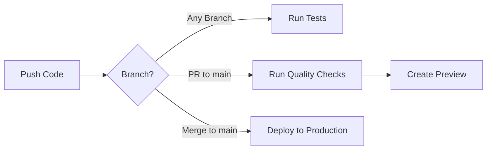

# CI/CD Pipeline Setup - Quick Reference

## 🚀 What Was Implemented

This document provides a quick overview of the CI/CD pipeline setup for AdGenXAI.

## 📋 Workflows Overview

### Automated Testing (`test.yml`)
- **Triggers**: All pushes and pull requests
- **Actions**:
  - TypeScript type checking
  - Vitest test suite execution
  - Coverage reporting (60% minimum threshold)
  - Coverage artifact uploads
- **Status**: ✅ Configured and ready

### Code Quality (`quality.yml`)
- **Triggers**: PRs to main, pushes to main
- **Jobs**:
  - **ESLint**: Code quality enforcement
  - **Prettier**: Code formatting checks
  - **Security**: npm audit for vulnerabilities
  - **Bundle Size**: Track and report bundle sizes
- **Status**: ✅ Configured and ready

### Deployment (`deploy.yml`)
- **Triggers**: PRs to main, pushes to main
- **Environments**:
  - Production (main branch)
  - Preview (pull requests)
- **Features**:
  - Pre-deployment validation
  - Automated Netlify deployment
  - Rollback notifications
  - Build artifact storage
- **Status**: ⚙️ Requires secrets configuration

### Performance (`lighthouse.yml`)
- **Triggers**: PRs to main, pushes to main
- **Metrics**:
  - Performance (80%+ target)
  - Accessibility (90%+ target)
  - Best Practices (90%+ target)
  - SEO (90%+ target)
- **Status**: ✅ Configured and ready

### Security (`codeql.yml`)
- **Triggers**: PRs to main, pushes to main, weekly schedule
- **Languages**: JavaScript/TypeScript, GitHub Actions
- **Status**: ✅ Already configured (existing)

### Dependencies (`dependabot.yml`)
- **Schedule**: Weekly updates
- **Ecosystems**: npm packages, GitHub Actions
- **Status**: ✅ Already configured (existing)

## 🛠️ Configuration Files

| File | Purpose | Status |
|------|---------|--------|
| `.eslintrc.json` | ESLint configuration | ✅ Created |
| `.prettierrc.json` | Prettier formatting rules | ✅ Created |
| `.prettierignore` | Prettier ignore patterns | ✅ Created |
| `.lighthouserc.json` | Lighthouse CI thresholds | ✅ Created |
| `vitest.config.ts` | Test coverage thresholds | ✅ Updated |
| `package.json` | Lint/format scripts | ✅ Updated |

## 📝 npm Scripts

```bash
# Linting
npm run lint              # Check code quality
npm run lint:fix          # Auto-fix issues

# Formatting
npm run format            # Format all files
npm run format:check      # Check formatting

# Testing
npm test                  # Run tests
npm run test:watch        # Watch mode
npm run test:ci           # With coverage

# Type Checking
npm run typecheck         # TypeScript validation

# Building
npm run build             # Production build
```

## 📚 Documentation

| Document | Description |
|----------|-------------|
| `docs/CI_CD_GUIDE.md` | Complete CI/CD documentation |
| `docs/BRANCH_PROTECTION_GUIDE.md` | Branch protection setup |
| `docs/ENVIRONMENT_VARIABLES.md` | Environment variable management |
| `README.md` | Updated with badges and quick start |

## 🎫 Issue Templates

Located in `.github/ISSUE_TEMPLATE/`:
- `bug_report.md` - Bug reporting template
- `feature_request.md` - Feature request template
- `documentation.md` - Documentation improvements
- `config.yml` - Template configuration

## ✅ Setup Checklist

### Immediate (Required for Deployment)
- [ ] Add `NETLIFY_AUTH_TOKEN` to GitHub Secrets
- [ ] Add `NETLIFY_SITE_ID` to GitHub Secrets
- [ ] Merge this PR to enable workflows

### Recommended (Within 24 hours)
- [ ] Configure branch protection for `main`
  - Require PR reviews
  - Require status checks: test, lint, format, security
  - See `docs/BRANCH_PROTECTION_GUIDE.md`
- [ ] Set up Netlify environment variables
  - See `docs/ENVIRONMENT_VARIABLES.md`

### Optional (As needed)
- [ ] Configure Slack/Discord notifications
- [ ] Set up performance budgets
- [ ] Customize quality thresholds
- [ ] Add custom status badges

## 🔐 GitHub Secrets Setup

### Step 1: Get Netlify Credentials

1. Go to [Netlify Dashboard](https://app.netlify.com)
2. Navigate to User Settings → Applications
3. Create a new personal access token
4. Copy the token (save it securely)
5. Go to your site → Site Settings → General
6. Copy the Site ID

### Step 2: Add to GitHub

1. Go to repository Settings
2. Navigate to Secrets and variables → Actions
3. Click "New repository secret"
4. Add `NETLIFY_AUTH_TOKEN` with your token
5. Add `NETLIFY_SITE_ID` with your site ID

## 🎯 Quality Gates

### All PRs Must Pass:
- ✅ All tests passing
- ✅ TypeScript type checking
- ✅ ESLint (no errors)
- ✅ Prettier formatting
- ✅ Security audit (no high/critical)
- ✅ 60%+ test coverage

### Performance Targets:
- 🎯 Lighthouse Performance: 80%+
- 🎯 Lighthouse Accessibility: 90%+
- 🎯 Lighthouse Best Practices: 90%+
- 🎯 Lighthouse SEO: 90%+

## 🔄 Workflow Triggers



## 📊 Current Status

| Component | Status | Notes |
|-----------|--------|-------|
| Test Suite | ✅ Working | 58 tests passing |
| ESLint | ✅ Working | Minor style warnings (pre-existing) |
| Prettier | ✅ Working | Configured |
| CodeQL | ✅ Passing | 0 security alerts |
| Coverage | ✅ Working | Threshold: 60% |
| Lighthouse | ⚙️ Configured | Ready to run |
| Deployment | ⚙️ Pending | Needs GitHub secrets |
| Dependabot | ✅ Active | Weekly updates |

## 🆘 Quick Troubleshooting

### Tests Failing?
```bash
npm ci              # Clean install
npm run typecheck   # Check TypeScript
npm test            # Run locally
```

### Linting Errors?
```bash
npm run lint:fix    # Auto-fix issues
npm run format      # Format code
```

### Build Failing?
```bash
npm run build       # Test build locally
npm run typecheck   # Check for TS errors
```

### Deployment Not Working?
1. Verify GitHub secrets are set
2. Check Netlify dashboard for errors
3. Review workflow logs in Actions tab

## 📞 Support

- **Documentation**: See `docs/CI_CD_GUIDE.md`
- **Issues**: Use GitHub issue templates
- **Workflows**: Check Actions tab for logs
- **Netlify**: Check Netlify dashboard

## 🎉 Success Indicators

You'll know the setup is working when:
- ✅ Green checkmarks appear on commits
- ✅ PR comments show deployment previews
- ✅ Main branch deploys automatically
- ✅ Coverage reports are generated
- ✅ Quality checks block bad code
- ✅ Lighthouse scores are tracked

## 🚀 Next Steps After Merge

1. **Enable the pipeline**:
   ```bash
   # Merge this PR
   # Workflows activate automatically
   ```

2. **Configure secrets**:
   - Add Netlify credentials to GitHub
   - Verify deployment works

3. **Set up branch protection**:
   - Follow `docs/BRANCH_PROTECTION_GUIDE.md`
   - Test with a sample PR

4. **Configure Netlify**:
   - Set environment variables
   - Test deployment

5. **Optional enhancements**:
   - Add Slack/Discord notifications
   - Customize performance budgets
   - Add more quality gates

---

**Questions?** See the comprehensive documentation in the `docs/` directory or create an issue using the provided templates.
